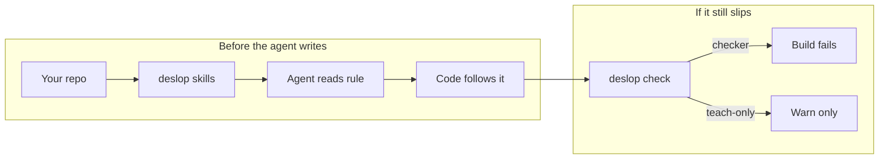
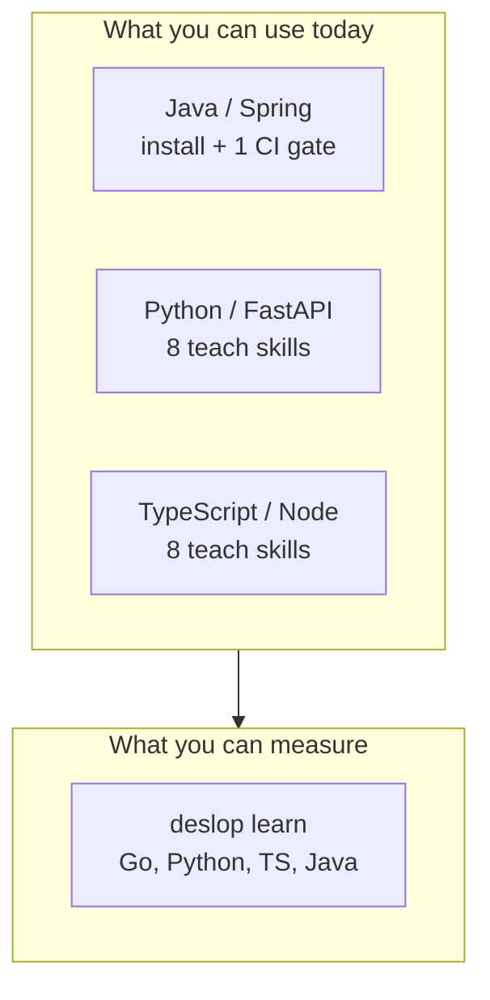
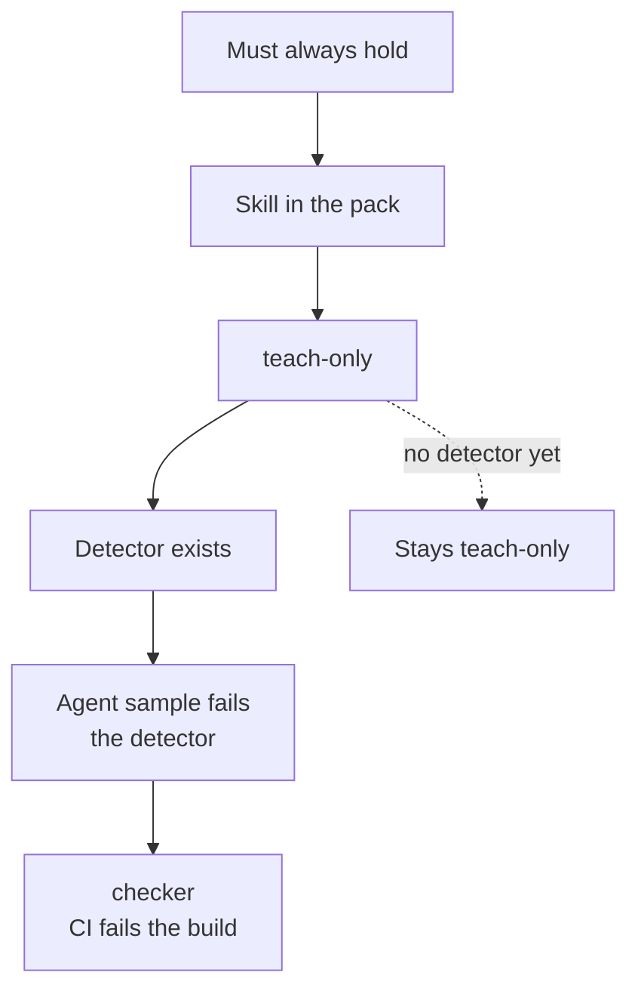
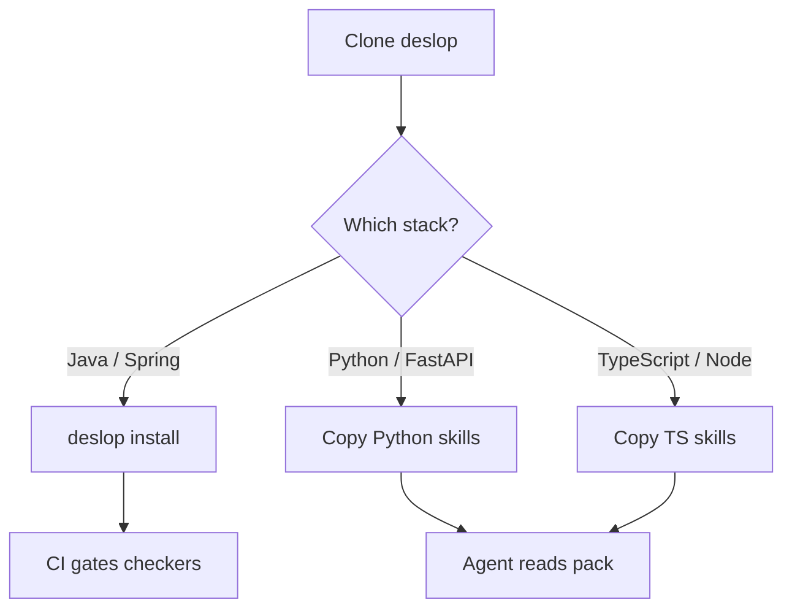
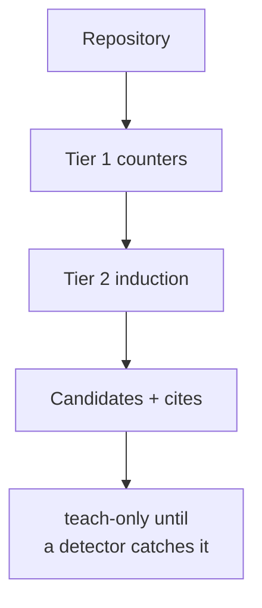

# deslop

Rules your coding agents read **before** they write code — across
**Java/Spring**, **Python/FastAPI**, and **TypeScript/Node/React**. CI
gates the patterns we can *prove* agents emit.

Most tools comment on a pull request after the damage is done. deslop
puts a small pack of invariants in the agent's context first, then runs a
deterministic checker on the subset with verified detectors.



## Stacks

Three packs ship in this repo. `deslop learn` also profiles **Go**.

| Pack | Languages / frameworks | Rules | CI today |
|---|---|---|---|
| [`deslop-java-spring`](skills/deslop-java-spring/SKILL.md) | Java, Spring, JPA | 3 | **1 checker** (JPQL optional-filter) + 2 teach-only |
| [`deslop-python-fastapi`](skills/deslop-python-fastapi/SKILL.md) | Python, FastAPI, Pydantic, httpx | 8 | teach-only |
| [`deslop-ts-node`](skills/deslop-ts-node/SKILL.md) | TypeScript, Node, Express, React | 8 | teach-only |
| `deslop learn` | Go, Python, TypeScript, Java | — | measures conventions; does not install a pack |



`deslop install` writes the **Java/Spring** pack-index into a target repo.
Python and TypeScript packs live as skills here — copy the pack-index
directory plus its `no-*` skills into your agent's layout (see
[Using a pack](#using-a-pack)). Multi-pack install is not wired yet; do
not pretend `deslop install` drops FastAPI or Node rules into a repo.

## How a rule reaches CI

An invariant is a property that must always hold. Every rule starts as
**teach-only** (steering). It becomes **checker** only after a detector
exists *and* an independently produced agent-written sample fails that
detector. See
[docs/composer-experiment.md](docs/composer-experiment.md) for the
evidence behind the first Java checker.



## Pack contents

### Java / Spring

| Rule | Enforcement | Invariant |
|---|---|---|
| `no-jpql-null-or-lower` | **checker** | No `:param IS NULL OR` combined with `LOWER` on optional JPQL filters; use an empty-string sentinel |
| `no-transactional-external-io` | teach-only | No HTTP / S3 / messaging inside `@Transactional`; persist, commit, then send |
| `no-rest-template-without-timeout` | teach-only | No `new RestTemplate()` without `setRequestFactory` timeout shaping |

### Python / FastAPI

All teach-only. Pack index: [`skills/deslop-python-fastapi`](skills/deslop-python-fastapi/SKILL.md).

| Rule | Invariant |
|---|---|
| `no-sync-blocking-io-in-async-route` | No sync blocking I/O inside `async def` routes |
| `no-httpx-asyncclient-without-timeout` | `httpx.AsyncClient` gets an explicit `timeout=` |
| `no-except-exception-pass` | No `except Exception: pass` |
| `no-fstring-sql-interpolation` | Bound parameters, not f-string SQL |
| `no-post-validation-model-mutation` | Do not mutate Pydantic fields after validation |
| `no-fire-and-forget-task-without-cancellation` | Keep a reference; handle cancellation |
| `no-secret-defaults-in-settings` | No secrets as settings / signature defaults |
| `no-route-without-response-model` | Declare `response_model=` (or annotated responses) |

### TypeScript / Node / React

All teach-only. Pack index: [`skills/deslop-ts-node`](skills/deslop-ts-node/SKILL.md).

| Rule | Invariant |
|---|---|
| `no-floating-promises` | Await or explicitly handle every promise |
| `no-fetch-without-abort-timeout` | Pair `fetch` with an abort timeout |
| `no-empty-catch-in-express-handlers` | Catch, log, and return an error response |
| `no-unvalidated-env-at-module-top-level` | Lazy, validated env — not `process.env.X ?? ""` at import |
| `no-unguarded-json-parse-on-external-input` | Guard `JSON.parse` on external text |
| `no-non-null-array-index` | Bounds-check; do not silence `noUncheckedIndexedAccess` with `!` |
| `no-mixed-controlled-react-inputs` | Controlled or uncontrolled, never mixed |
| `no-setinterval-without-clear` | Store the handle and clear it on cleanup |

## Using a pack



### Java / Spring (install + CI)

```bash
git clone https://github.com/Amaresh/deslop && cd deslop
pip install -e .            # engine + deps (pydantic, PyYAML)

# Inspect the Java pack (writes nothing)
python3 scripts/deslop.py review

# Check any Java/Spring repo for checker-rule violations
python3 scripts/deslop.py check --repo-root /path/to/your/repo

# Install into a target repo (refuses if it already has agent rules; --force to override)
python3 scripts/deslop.py install --target /path/to/your/repo
```

Install writes one namespaced pack-index skill
(`skills/deslop/deslop-java-spring/`) into the target's `.agents/skills/`
layout plus reference files, reports collisions with existing agent
instructions, pins the installed version for `update`/`rollback`, and never
dumps sibling skills.

```bash
scripts/ci.sh /path/to/your/repo   # exit 1 on checker findings only
```

See [`ci/github-action.yml.example`](ci/github-action.yml.example) for a
GitHub Actions setup.

### Python or TypeScript (skills in this repo)

There is no `deslop install --pack python` yet. To steer an agent:

1. Copy the pack-index folder (`skills/deslop-python-fastapi/` or
   `skills/deslop-ts-node/`).
2. Copy each `skills/no-*` directory listed in that pack's `pack.yaml`.
3. Point your harness at those skills the same way you would any other
   SKILL.md pack.

CI will not fail on these rules until they earn `checker` status.

## deslop learn — extract the rules a codebase already follows

`deslop learn` measures the conventions a repository actually follows (and
the ones it keeps violating), then emits candidate rules with evidence.
Works on **Go, Python, TypeScript, and Java**.

```bash
python3 scripts/learn.py --repo /path/to/repo --lang go --out learn-out
```



Learn is the "find rules" counterpart to "apply rules": point it at a repo
and it tells you what that repo would teach a new contributor.

## What deslop is not

- Not an AI code reviewer. It does not comment on pull requests or scan
  diffs after the fact; it shapes what the agent writes and gates a
  verified subset deterministically.
- No auto-attach guarantees. Whether your agent loads the installed skill
  depends on your harness; discovery behavior varies.
- Teach rules are not gates and must not be sold as gates.
- Not "works on any Spring / FastAPI / Node repo." Packs are small and
  specific. One Java rule is CI-gated; the rest steer.

## License

MIT
