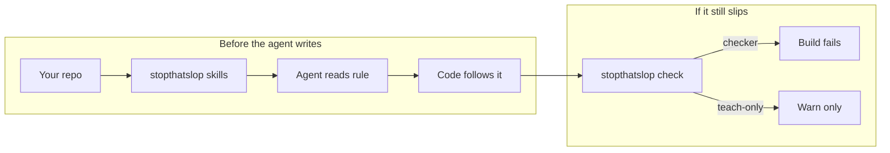
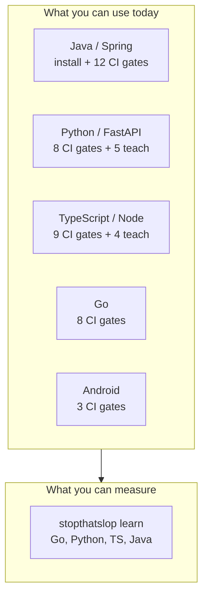
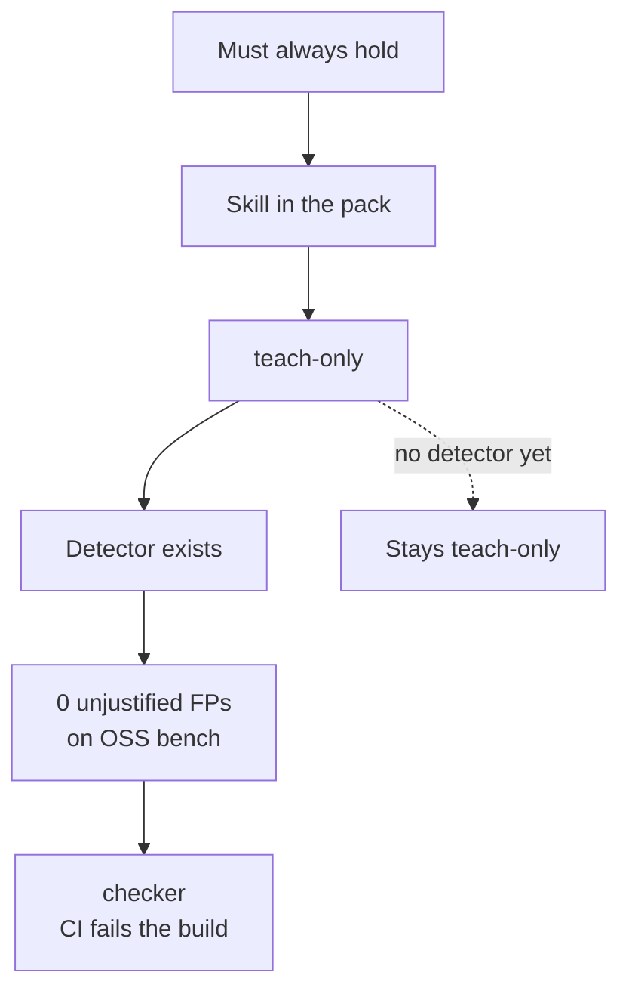
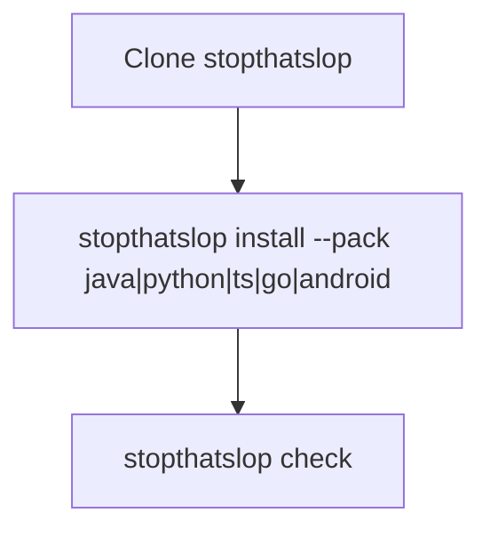
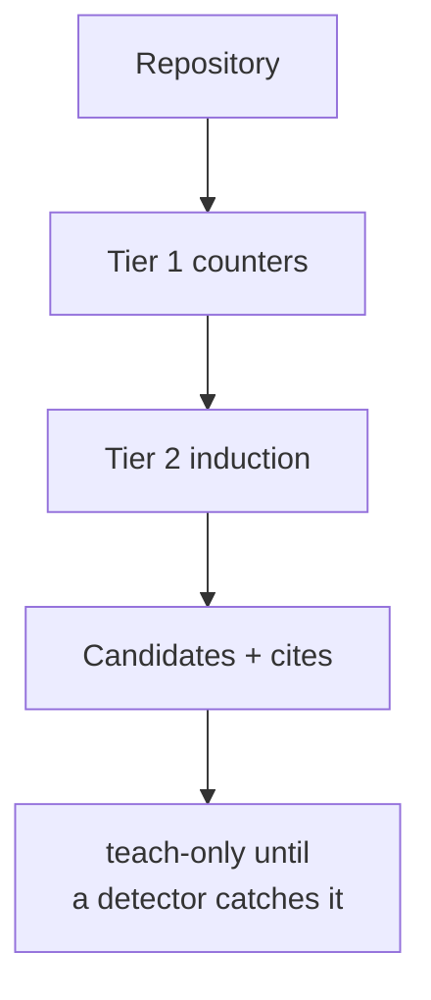

# stopthatslop

Formerly published as deslop.

Rules your coding agents read **before** they write code — across
**Java/Spring**, **Python/FastAPI**, **TypeScript/Node/React**, **Go**,
and **Android**. CI gates the patterns we can *prove* agents emit.

Most tools comment on a pull request after the damage is done. StopThatSlop
puts a small pack of invariants in the agent's context first, then runs a
deterministic checker on the subset with verified detectors.



## Stacks

Five packs ship in this repo. `stopthatslop learn` also profiles **Go**.

| Pack | Languages / frameworks | Rules | CI today |
|---|---|---|---|
| [`stopthatslop-java-spring`](skills/stopthatslop-java-spring/SKILL.md) | Java, Spring, JPA | 12 | **12 checkers** |
| [`stopthatslop-python-fastapi`](skills/stopthatslop-python-fastapi/SKILL.md) | Python, FastAPI, Pydantic, httpx | 13 | **8 checkers**, 5 teach-only |
| [`stopthatslop-ts-node`](skills/stopthatslop-ts-node/SKILL.md) | TypeScript, Node, Express, React | 13 | **9 checkers**, 4 teach-only |
| [`stopthatslop-go`](skills/stopthatslop-go/SKILL.md) | Go, net/http, database/sql | 8 | **8 checkers** |
| [`stopthatslop-android`](skills/stopthatslop-android/SKILL.md) | Kotlin, Android, Compose | 3 | **3 checkers** |
| `stopthatslop learn` | Go, Python, TypeScript, Java | — | measures conventions; does not install a pack |



`stopthatslop install --pack <java|python|ts|go|android>` writes that pack's
index plus glob-scoped Cursor rules. Pass the alias or the pack id.
`stopthatslop check` runs every pack whose language is present in the repo,
or pin one with `--pack python` (or `ts`, `go`, `android`, `java`).

## How a rule reaches CI

An invariant is a property that must always hold. Every rule starts as
**teach-only** (steering). It becomes **checker** after a detector exists
and OSS benches show **0 unjustified false positives**.



The gated checkers are portable AST detectors under `checkers/`. They are
not project-specific house rules (no web-layer folder names, no service-locator
bans, no blanket `no-use-effect`). JPQL optional-filters, RestTemplate
timeouts, and `@Transactional` IO are the same JavaParser checkers as the
rest of the Java pack.

## Pack contents

### Java / Spring

| Rule | Enforcement | Invariant |
|---|---|---|
| `no-jpql-null-or-lower` | **checker** | No `:param IS NULL OR` combined with `LOWER` on optional JPQL filters |
| `no-transactional-external-io` | **checker** | No HTTP / S3 / messaging inside `@Transactional` |
| `no-rest-template-without-timeout` | **checker** | No `new RestTemplate()` without `setRequestFactory` timeout shaping |
| `no-n-plus-one-without-entity-graph` | **checker** | No collection finder + lazy to-many in a loop without a fetch graph |
| `no-query-string-concatenation` | **checker** | No JPQL/SQL built with `+` concatenation |
| `no-file-upload-without-validation` | **checker** | Uploads get size/type checks |
| `no-secret-fallback-literal` | **checker** | No secret string fallback when env is missing |
| `no-java-raw-pii-logging` | **checker** | No raw email/phone in logs |
| `no-eager-to-many-fetch` | **checker** | No `FetchType.EAGER` on to-many associations |
| `no-controller-direct-repository-access` | **checker** | Controllers do not inject repositories |
| `no-unbounded-findall-without-pagination` | **checker** | No unbounded `findAll()` on a request path |
| `no-after-commit-dispatch-from-after-commit-listener` | **checker** | No `dispatchAfterCommit*` / `registerSynchronization` from AFTER_COMMIT listeners |

Java AST checkers need **JDK 21** (`javac` / `java`). JavaParser is fetched
once and SHA-256 pinned.

### Python / FastAPI

Pack index: [`skills/stopthatslop-python-fastapi`](skills/stopthatslop-python-fastapi/SKILL.md).

| Rule | Enforcement | Invariant |
|---|---|---|
| `no-sync-blocking-io-in-async-route` | **checker** | No sync blocking I/O inside `async def` routes |
| `no-httpx-asyncclient-without-timeout` | **checker** | `httpx.AsyncClient` gets an explicit `timeout=` |
| `no-except-exception-pass` | **checker** | No `except Exception: pass` |
| `no-dynamic-sql-execution` | **checker** | Bound parameters, not f-string / concat SQL |
| `no-route-request-json-without-invalid-json-guard` | **checker** | Guard `request.json` on untrusted bodies |
| `no-raw-pii-logging` | **checker** | No raw email/phone in logs |
| `no-request-layer-outbound-client-construction` | **checker** | Do not construct HTTP clients inside routes |
| `no-requests-call-without-timeout` | **checker** | Every `requests` call has `timeout=` |
| `no-fstring-sql-interpolation` | teach-only | Prefer bound parameters (overlap with dynamic SQL) |
| `no-post-validation-model-mutation` | teach-only | Do not mutate Pydantic fields after validation |
| `no-fire-and-forget-task-without-cancellation` | teach-only | Keep a reference; handle cancellation |
| `no-secret-defaults-in-settings` | teach-only | No secrets as settings / signature defaults |
| `no-route-without-response-model` | teach-only | Declare `response_model=` |

### TypeScript / Node / React

Pack index: [`skills/stopthatslop-ts-node`](skills/stopthatslop-ts-node/SKILL.md).
Needs **Node + npm** (TypeScript parser under `checkers/tsast`).

| Rule | Enforcement | Invariant |
|---|---|---|
| `no-fetch-without-abort-timeout` | **checker** | Pair `fetch` with an abort timeout |
| `no-empty-catch-in-express-handlers` | **checker** | Catch, log, and return an error response |
| `no-unguarded-json-parse-on-external-input` | **checker** | Guard `JSON.parse` on external text |
| `no-mixed-controlled-react-inputs` | **checker** | Controlled or uncontrolled, never mixed |
| `no-unvalidated-external-href` | **checker** | Allowlist `http(s)` before `href={expr}` |
| `no-orphaned-effect-timeouts` | **checker** | Clear effect timers on cleanup |
| `no-eager-heavy-dependency-import` | **checker** | Do not statically import lodash/moment-class libs |
| `no-or-default-for-nonzero-number` | **checker** | Do not `n \|\| 20` when 0 is valid |
| `no-node-builtin-in-client-module` | **checker** | No `node:fs` / `path` / `child_process` in `'use client'` modules |
| `no-floating-promises` | teach-only | Await or handle every promise (needs types) |
| `no-unvalidated-env-at-module-top-level` | teach-only | Lazy, validated env |
| `no-non-null-array-index` | teach-only | Bounds-check; do not silence with `!` |
| `no-setinterval-without-clear` | teach-only | Store the handle and clear it |

### Go

Pack index: [`skills/stopthatslop-go`](skills/stopthatslop-go/SKILL.md). Needs **Go 1.21+**.

| Rule | Enforcement | Invariant |
|---|---|---|
| `no-plain-string-secret-comparison` | **checker** | Constant-time secret compare |
| `no-go-dynamic-sql-execution` | **checker** | Bound parameters, not `fmt.Sprintf` SQL |
| `no-handler-detached-goroutine` | **checker** | No detached `go` from a handler |
| `no-handler-direct-sql-execution` | **checker** | Handlers do not run SQL |
| `no-handler-direct-outbound-http` | **checker** | Handlers do not `http.Get` |
| `no-handler-rooted-background-context` | **checker** | Use `r.Context()`, not `context.Background()` |
| `no-nullable-column-scanned-as-plain-value` | **checker** | Scan nullable columns into `sql.Null*` |
| `no-websocket-upgrader-checkorigin-allow-all` | **checker** | `CheckOrigin` must not always return true |

### Android

Pack index: [`skills/stopthatslop-android`](skills/stopthatslop-android/SKILL.md).

| Rule | Enforcement | Invariant |
|---|---|---|
| `no-hardcoded-secret-literals` | **checker** | No API keys as string literals |
| `no-unscoped-boundary-coroutine` | **checker** | No `GlobalScope` at UI boundaries |
| `no-runblocking-hotpath` | **checker** | No `runBlocking` on the UI path |

## Using a pack



### Check any stack (CI)

```bash
git clone https://github.com/StopThatSlop/stopthatslop && cd stopthatslop
pip install -e .            # puts `stopthatslop` on PATH

stopthatslop review
stopthatslop check --repo-root /path/to/your/repo
stopthatslop check --repo-root /path/to/your/repo --pack python
```

### Install a pack

`--pack` is required. Aliases: `java`, `python`, `ts`, `go`, `android`
(or the full pack id).

```bash
stopthatslop install --target . --pack java
stopthatslop install --target . --pack python
```

Install writes:

- Pack-index + references under
  `.agents/skills/stopthatslop/<pack-folder>/`
- Glob-scoped Cursor rules
  `.cursor/rules/stopthatslop-<skill>.mdc` with `alwaysApply: false`
  so the harness *can* load them when matching files are in context
- If the target already has `.claude/`, the same pack under
  `.claude/skills/stopthatslop/<pack-folder>/`
- If the target already has `.github/`, Copilot instructions under
  `.github/instructions/stopthatslop-<pack>.instructions.md`

It reports collisions with existing agent instructions, pins the version
for `update`/`rollback`, and does not rewrite `AGENTS.md` unless you pass
`--write-agents-md` (one-line pointer, never a generated dump).

```bash
scripts/ci.sh /path/to/your/repo   # exit 1 on checker findings only
```

See [`ci/github-action.yml.example`](ci/github-action.yml.example) for a
GitHub Actions setup (Python plus JDK / Node / Go when those stacks are
present). This repo's own workflow is `.github/workflows/check.yml`.

`stopthatslop check --pack <alias>` still gates the checker rules even if you
never install the skills.

## stopthatslop learn — extract the rules a codebase already follows

`stopthatslop learn` measures the conventions a repository actually follows (and
the ones it keeps violating), then emits candidate rules with evidence.
Works on **Go, Python, TypeScript, and Java**.

```bash
stopthatslop learn --repo /path/to/repo --lang go --out learn-out
```



Learn is the "find rules" counterpart to "apply rules": point it at a repo
and it tells you what that repo would teach a new contributor.

## What stopthatslop is not

- Not a linter. Not a PR bot. These are rules the agent reads before it
  types. StopThatSlop does not comment on pull requests.
- No auto-attach guarantees. Install writes glob-scoped Cursor rules so the
  harness *can* load them when matching files are in context; the harness
  still decides. Discovery behavior varies.
- Teach rules are not gates and must not be sold as gates.
- Not "works on any Spring / FastAPI / Node repo." Packs are small and
  specific. Java, Python, TypeScript, Go, and Android each gate the
  subset with 0 unjustified OSS false positives.

## License

MIT
